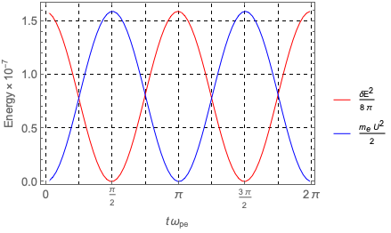

# Overview

This is a simulation demoing plasma oscillations (or Langmuir oscillations) for a plasma 
with cold electrons and immobile ions.
The goal of this exercise is to

1) Familiarize oneself with the compile-run process;
2) Read in and analyze the simulation data products; and
3) Confirm the linear theory predictions of the plasma oscillations.

# Compilation

* In essence, issuing `CXX='clang++' make -j4 all` in the terminal will
compile the source codes and produce an executable called `pic_1d`.

    * The `-jx` flag instructs `make` to compile up to `x` number of source codes in parallel.
    The optimal value for `x` will be the number of cpu cores.

    * The `CXX` flag instructs `make` what c++ compiler it should use.
    The c++ compiler for the compilation must support the c++17 language standard or above.
    The default value for the `CXX` flag is `clang++` for macOS operating systems.
    GCC users, for example, will need to use `CXX=g++`.

    * Instead of passing it as the command line argument,
    one can specify the c++ compiler flag `CXX` in `Makefile`.
    In fact, `Makefile` contains other flags for further customization.

* As usual, issuing `make clean` will clean up the build products
(but not the data files produced by the simulation).

* To run the simulation, execute `./pic_1d`.

    Several default parameters of the simulation can be reconfigured through command line arguments.
    Supported are:

    * `-save` instructs to take a snapshot from which the simulation can resume at a later time.
    * `-load` instructs to restore the state from the latest snapshot and resume the simulation from the last point.
    * `--wd="working_directory"` instructs to use `"working_directory"` as the working directory.
    (The default is the value of the `working_directory` variable in the `Inputs.h`.)
    * `--outer_Nt="a non-negative integer"` instructs to run the simulation by `inner_Nt x outer_Nt` cycles.
    (The default is the value of the `outer_Nt` variable in the `Inputs.h`.)

    For this demo though, no extra arguments are necessary.

# Data Products

All data products (except for the snapshots) are formatted as comma-separated-values, or `csv`.
There are four types of data products that the code is configured to produce:

* `energy.csv` contains grid-point averaged field and plasma species energy density.

    The first field, `step`, is the simulation step count.
    The second field, `time`, is the simulation time, equivalent to `step` x `∆t`.
    The `dB[123]^2/2` fields are the energy densities of the fluctuating magnetic field components
    parallel (`1`) and perpendicular (`2` and `3`) to the background magnetic field.
    Likewise, The `dE[123]^2/2` fields are the energy densities for the electric field.
    The subsequent fields, appearing in a group of six, describe the energy densities of, if present,
    each plasma species.
    Since there is only one plasma species for this demo (i.e., cold electrons), there is only one group.
    In each group, the `mv[123]^2/2` fields are the kinetic energy densities, and
    the `mU[123]^2/2` fields are the bulk flow energy densities (that is, kinetic energy - thermal energy).
    The suffixes `123` denote the directions relative to the background magnetic field.

* `field-*.csv` contains the magnetic and electric fields at every grid points,
where the wildcard `*` is the placeholder for the step count at which this data has been dumped.

    Each file contains the field components at an instance of time which is encoded in the first line
    of its contents.
    The first line is self-explanatory:
    `step` and `time` are the same as those appeared in `energy.csv`, and
    `Dx` and `Nx` are the grid size, `∆x`, and the number of grid points, `Nx`, respectively.

    The rest of the data are the magnetic (`dB[123]`) and electric (`dB[123]`) field data.

* `moment-*.csv` contains velocity moments of the plasma species,
where the wildcard `*` is the placeholder for the step count at which this data has been dumped.

    Similar to the field data, the first line encodes information about the current simulation time,
    the simulation grid, and additionally the number of plasma species (for this demo, `Ns = 1`).

    The rest of the data are the plasma moments.
    For each plasma species, there are seven columns:

    - `<1>` is the zeroth-order velocity moment;
    - `<v[123]>` are the three components of the first-order velocity moment
    (again, the suffixes denoting directions relative to the background magnetic field); and
    - `<v[123]v[123]>` are the diagonal components of the second-order velocity moment,
    
    where `<...>` denotes ∫(...) *f*(**v**) d**v**.

* Finally, `particle-*.csv` contains a subset of simulation particles for the particle species,
where the wildcard `*` is the placeholder for the step count at which this data has been dumped.
We will come back to this in later demos.

# Simulation Setup

The `Inputs.h` file contains all the physical parameters needed as well as 
those necessary to produce data products.
Some of them can be overwritten using the command line arguments (See the section [Compilation](#Compilation)).

The one-dimensional simulation of this demo is normalized such that
the speed of light is `c = 1` and the electron plasma frequency is `ω_pe = 1`.
Hence, the electron inertial length is `c/ω_pe = 1`.
What that means is that
all the quantities with the length dimension are normalized to the inertial length,
all the quantities with the time dimension are normalized to the inverse of the electron plasma frequency, and
all the quantities with the speed dimension are normalized to the speed of light.
Electrons are assumed to be cold fluid, and charge-neutralizing ions are immobile (infinite mass).

The grid size of the one-dimensional simulation domain (in the `x` direction) is `∆x = 0.200781` and
the integration time step is `∆t = 2π/100`.
The number of grid points are `Nx = 10` and the periodic boundary conditions are used at both ends.

To stir up the system at the beginning, which is otherwise quiet,
the electric field is initialized with small-amplitude random fluctuations.

The simulation results will be dumped into (by default) `./data` with data recording frequencies
specified by the `*_recording_frequency` options in the `Inputs.h` file.
An output directory other than the default one, say `my_sim` at the home directory,
can be reconfigured in the command line as follows:

> `./pic_1d --wd=~/my_sim`.

# Analysis of the Results

## Average Field and Plasma Energy

Let us read `energy.csv` with your favorite data analysis program.
(For `Mathematica` users, see the `analysis.nb` notebook.)

A couple of things are worth mentioning.
First, being electrostatic, there is no magnetic field fluctuations associated with the plasma oscillations.
In addition, the electric field vector oscillates in the `x` direction
(in this demo, the suffix-`1` component).
The same goes to the bulk flow velocity of cold electrons.

Second, because electrons are treated as a cold fluid, there is no thermal energy, and therefore
`mv1^2/2` == `mU1^2/2`.

What we are interested in is the total electric field energy (*E*^2/8π; equal to `dE1^2/2`), and
the total energy of cold electrons (*mv*^2/2; equal to `mv1^2/2`).
So grap them and plot them versus `time`.
(Remember the time is normalized by 1/ω_pe.)
The figure below shows them up to *t* = 2π/ω_pe, which is one cycle of the plasma oscillations.
(Think about why there are two cycles in the figure.)

## Electric Field and Flow Velocity

Let us read the `field`s and `moment`s and retrieve `dE1` and `<v1>`,
which we will refer to as *E_x* and *U_x*, respectively.
Then take the values at the first grid point and plot them against `time`.
The figure below shows *E_x* and *U_x* up to *t* = 5π/ω_pe.

Notice the phase difference: *E_x* is behind *U_x* by a quarter cycle.
According to theory, *U_x* and *E_x* have the following relationship:

> *U_x* = –*i* (*eE_x*/ω_pe *m_e*).

Noting that –*i* = exp(–*i* π/2), the phase difference is π/2 and the '–' sign indicates that
*U_x* is indeed leading *E_x*.

