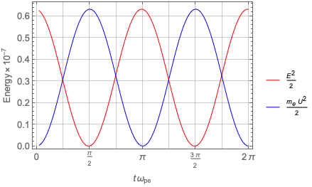

# Overview

This is a demo simulation showing plasma oscillations (or Langmuir oscillations) for a plasma 
composed of cold electrons and immobile ions.
The goal of this exercise is to

1) Familiarize oneself with the compile-run process;
2) Read and analyze the simulation data products; and
3) Confirm the linear theory prediction of the plasma oscillations.

# Build and Run

## Compilation

`Makefile` contains minimal build options. One may need to change the settings appropriate
for his/her build environment.
For macOS users, it will work out of the box with the latest OS version and either Xcode or command line tools installed.
Linux users must have a c++ compiler with c++17 support.
Some linux distributions may need to change the `-lpthread` option to `-pthread` (without `l` at the beginning).

As usual, issuing `make` in the terminal will compile the source codes and build an executable
called `pic_1d` in the build directory.
If supported, the `-jx` option allows parallel compilation of source codes, where `x` is typically
the number of cpu cores; for example, `make -j4`.
`make clean` will clean up the intermediate build products as well as the executable
(but not the data files produced by the simulation).

## Run

To run the simulation, execute `./pic_1d` in the terminal.
For later demos, optional arguments may also be needed (which will be explained later).

# Data Products

All data products (except for snapshots) are formatted as comma-separated-values, or `csv`.
There are four types of data products:

* `energy.csv` contains grid-point averaged field and plasma energy densities.

    The first field, `step`, is the simulation step count.
    The second field, `time`, is the simulation time, equivalent to `step` x `∆t`.
    The `dB[123]^2/2` fields are the energy densities of the fluctuating magnetic field components
    parallel (`1`) and perpendicular (`2` and `3`) to the background magnetic field.
    Likewise, The `dE[123]^2/2` fields are the energy densities for the electric field.
    The subsequent fields appear in a group of six and describe the energy densities of, if present,
    each plasma species.
    In each group, the `mv[123]^2/2` fields are the kinetic energy densities, and
    the `mU[123]^2/2` fields are the bulk flow energy densities (that is, kinetic energy - thermal energy).
    The suffixes `123` denote the directions relative to the background magnetic field as in the field notations.
    
    Since there is only one plasma species for this demo (i.e., cold electrons), there is only one group (or six fields).

* `field-*.csv` contains the magnetic and electric fields at every grid points,
where the wildcard character `*` is the placeholder for the step count at which this data has been dumped.

    Each file contains the field components at an instant of time which is encoded in the first line
    of its contents.
    The first line is self-explanatory:
    `step` and `time` are the same as those appeared in `energy.csv`, and
    `Dx` and `Nx` are the grid size, `∆x`, and the number of grid points, `Nx`, respectively.
    It will be straightforward to parse in any interpreted programs such as `python` and `IDL`.

    The rest of the data are the magnetic (`dB[123]`) and electric (`dB[123]`) field data.
    The numbers denote directions relative to the background magnetic field.

* `moment-*.csv` contains velocity moments of the plasma species,
where the wildcard character `*` is the placeholder for the step count at which this data has been dumped.

    Similar to the field data, the first line encodes information about the current simulation time,
    the simulation grid, and additionally the number of plasma species (for this demo, `Ns = 1`).

    The rest of the data are the plasma moments.
    For each plasma species, there are seven columns:

    - `<1>` is the zeroth-order velocity moment;
    - `<v[123]>` are the three components of the first-order velocity moment
    (again, the numbers denoting directions relative to the background magnetic field); and
    - `<v[123]v[123]>` are the diagonal components of the second-order velocity moment,
    
    where `<...>` is defined as ∫(...) *f*(**v**) d**v**.

* Finally, `particle-*.csv` contains a subset of simulation particles for the particle species,
where the wildcard character `*` is the placeholder for the step count at which this data has been dumped.
We will come back to this in later demos.

# Simulation Setup

The `Inputs.h` file contains all the physical parameters needed as well as 
those necessary to produce data products.
Since all demo simulations are preconfigured, no modification is needed.
If needed, some of them can be overwritten using the command line arguments.

The one-dimensional simulation of this demo is normalized such that
the speed of light is `c = 1` and the electron plasma frequency is `ω_pe = 1`.
Hence, the electron inertial length is `c/ω_pe = 1`.
What that means is that
all length quantities are normalized to the inertial length,
all time quantities are normalized to the inverse of the electron plasma frequency, and
all velocity quantities are normalized to the light speed.

Electrons are assumed to be cold fluid, and charge-neutralizing ions are immobile (infinite mass),
consistent with the assumption made.

The grid size of the one-dimensional simulation domain (which lies in the `x` direction) is `∆x = 0.200781` and
the integration time step is `∆t = 2π/100`.
The number of grid points are `Nx = 10` and the periodic boundary conditions are used at both ends.
As mentioned earlier, these attributes are available in the data files.

To stir up the system at the beginning, which is otherwise quiet,
the electric field is initialized with small-amplitude random fluctuations.

The simulation results for this demo will be dumped into the `./data` directory.

# Analysis of the Results

The data products needed depend on the type of demos.
Here, we will use the `energy`, `field`, and `moment` products.

## Average Field and Plasma Energy

Read `energy.csv` with your favorite program.
(For `Mathematica` users, see the `analysis.nb` notebook.)

A couple of things are worth mentioning.
First, being electrostatic, there is no magnetic field fluctuations associated with the plasma oscillations.
In addition, being longitudinal means that the electric field vector oscillates in the `x` direction
(in this demo, the suffix-`1` component).
The same goes to the bulk flow velocity of cold electrons.

Second, because electrons are treated as a cold fluid, there is no thermal energy, and therefore
`mv1^2/2` == `mU1^2/2`.

What we are interested in is the total electric field energy (*E*^2/8π; equal to `dE1^2/2`), and
the total energy of cold electrons (*mv*^2/2; equal to `mv1^2/2`).
So, grap and plot them versus `time`.
(Remember the time is normalized by 1/ω_pe.)
The figure below shows the plots of field and particle energy up to *t* = 2π/ω_pe,
which corresponds to one cycle of plasma oscillations.
(Think about why there are two cycles in the figure.)

## Electric Field and Flow Velocity

Read the `field` and `moment` files and retrieve `dE1` and `<v1>` quantities,
which we will refer to as *E_x* and *U_x*, respectively.
Then take the values at the first (or any other) grid point and plot them against `time`.
The figure below shows *E_x* and *U_x* up to *t* = 5π/ω_pe.

Notice the phase difference: *E_x* is behind *U_x* by a quarter cycle.
Recall that according to theory *U_x* and *E_x* have the following relationship:

> *U_x* = –*i* (*e* *E_x*)/(ω_pe *m_e*).

Because –*i* = exp(–*i* π/2), the phase difference is π/2 and the '–' sign indicates that
*U_x* is leading *E_x*.

