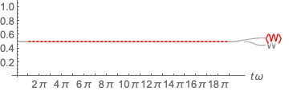

# Overview

The demos here cover

* Plane waves and polarization;
* Field energy density and Poynting flux; and
* Wave packets and group velocity

for electromagnetic waves in free space.

There are three demos related to Problems 14.2, 14.4, 14.6, and 14.12.

# Run

First, build the project using `make all` (with the options appropriate for your build system).

To run the demos,

> `./pic_1d -load --wd ./$DEMO`

replacing `$DEMO` with one of `01_prob_14_2`, `02_prob_14_4`, and `03_prob_14_12`
(these are the directory names).

It will produce `field-*.csv` files in the `$DEMO` directory.

# Parameters

For simplicity, the light speed is *c* = 1.
The number of grid points are *Nx* = 500 and the grid size is *Dx* = 2π/50.
Since the CFL condition requires *c* *dt* < *Dx*, the time step is set to *dt* = *Dx*/2.
But, because the **E** and **B** are dumped at every other step,
the time interval between two sequential dump files is *Dt* = 2*dt*.

# Demos

## 1. A Linearly Polarized Plane Wave `01_prob_14_2`

This demo is related to Problem 14.2(c).

For simplicity, let us assume *k* = 1 (thus *ω* = *kc* = 1), and *E0* = 1.
Also, the plane wave is traveling in the positive *x* direction, and
the associated **E** is linearly polarized in the *y* direction.
Then, by Faraday's law, **B** is also linearly polarized in the *z* direction.
(For the present demos, Faraday's law reads **B** = **k***c*/*ω* x **E** = **k**/*k* x **E**.)
Confirm yourself that wavelength, period, the magnitude of E & B, etc. are what you are supposed to get.

The two-dimensional intensity plots of *Ey* and *Bz* are shown below.
Observe that the plane wave indeed travels towards right.
Pick a point on a crest.
As time increases, that crest is traveling in the increasing *x* direction.
The slope of the constant phases gives you the phase speed, which is of course *c*.
You can confirm that the plane wave equation **E** = **y** *E0* exp(*ikx* - *iωt*) produces the same result.

Now let us calculate the Poynting vector, **S**, which for the present demos, is given by **S** = *c* **E** x **B**.
Therefore, the only non-zero component is *Sx* = *c* *Ey* *Ez*.
Using the wave period *P* = 2π/ω, the average Poynting vector is given by

The figure below shows *Sx* and <*Sx*> versus time at *x* = 0.
While *Sx* experiences sinusoidal oscillations (because *Ey* and *Bz* are in phase),
<*Sx*> maintains a constant value.

As a final check, Problem 14.4(c) shows <**S**> and the wave energy density *W* are related
through <**S**> = *c* <*W*>, where *W* is, for the normalization used in this code, given by
*W* = (*E*^2 + *B*^2)/2.
The figure below shows *W* and <*W*> versus time at *x* = 0.

Confirm that the time-averaged energy flow above is what you get using Eq. (5.13) in the textbook.

## 2. A Circularly Polarized Plane Wave `02_prob_14_4`

This demo is related to Problems 14.4 and 14.6.

For the polarized wave equation in Problem 14.4
**E** = *E*0 (**e**1 exp(*iα*1) + **e**2 exp(*iα*2)) exp[*i*(**k**·**r** - *ωt*)]

this demo assumes *E*0 = 1/√2; α1 = 0; α2 = π/2; *k* = 1.
This is the description of a righthand circularly polarized wave traveling in the increasing *x*
(or **e**3 in the problem) direction.
You should realize that the above equation is just superposition of two linearly-polarized plane waves,
but with different phases.
Each plane wave is the solution to the Maxwell equations.

The animation below demonstrates the sense of polarization of **E** and **B**.
The point of view is looking behind in front of the wave.
Check the polarization using the wave equation we initially assumed.

The figures below show <**S**> and <*W*>.
Explain this result (hint: Refer the linear polarization case).

## 3. Wave Packet & Group Velocity `03_prob_14_12`

This demo is related to Problem 14.12(a).
The parameters used are: *k*0 = 1.5 and *a* = 2√log(2)/0.6.
Each harmonic is assumed to be linearly polarized as described in Demo 1 with different *k*.

The corresponding initial wave packet, ψ(*x*, 0), calculated using two different methods is shown below.

The figure below presents the simulation result of wave packet propagation.
Since propagation of electromagnetic waves in free space is *nondispersive*,
the group velocity is the same as the phase velocity, *v*_g = *v*_ph = *c*.

Let's take a one-dimensional Fourier transform of *E_y* at an arbitrary instant.
This will give us the amplitude distribution *A*(*k*) of the prescribed wave packet.

