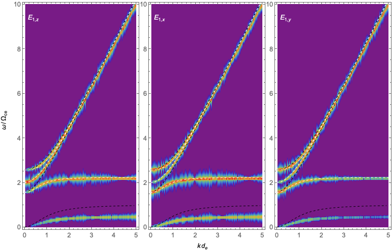

# Description

This demo illustrates waves in magnetoionic plasmas.
The aim is to identify different propagating modes at different propagation angles from the (simulated) electromagnetic signals.

# Build and Run

This tutorial includes three demo simulations located in `01_parallel`, `02_perpendicular`,
and `03_intermediate`, respectively.
The labels `parallel`, `perpendicular`, and `intermediate` refer to the propagation angles,
θ = 0, 90°, and 60°, respectively.

As usual, visit each directory, build the project using `make`, and execute `./pic_1d` produced.

The demos produce `field-*.csv` files.

# Simulation Setup

Consistent with the magnetoionic assumptions, ions are immobile and electrons are treated as being cold.
The uniform magnetostatic field is in the *z* direction, and the wave vector is in the *x*-*z* plane.
The ratio of the electron plasma frequency to the electron cyclotron frequency is *ωpe*/*Ωce* = 2.

The time is normalized to 1/*Ωce* and the distance to the electron skin depth, *de* = *c*/*ωpe*.
The light speed is *c* = 2.

Extract the electric field vector `dE[123]` and the magnetic field vectors `dB[123]` for analysis below.
As in the textbook notation, `dB1` = *B1_z*, `dB2` = *B1_x*, and `dB3` = *B1_y*, and
likewise, `dE1` = *E_z*, `dE2` = *E_x*, and `dE3` = *E_y*.

# Dispersion Relations

- Preparation

For analysis shown here, I am using the electric field only.
But, you should check the magnetic field as well, and see which part of signals are
elestrostatic and electromagnetic.

Convert the signals in the time-space domain into spectral power in the frequency-wave number domain.
Also prepare the theoretical dispersion relations assigned as homework for comparison.

- At θ = 0 `01_parallel`

This is for the case where the wave vector is parallel to the magnetostatic field.

The figure below displays the power spectral densities of the fluctuating electric field.
(The color bar not shown here is in logarithmic scale.)
The white dashed curves represent the theoretical dispersion relations for (from top to bottom)
the RCP (R mode), LCP (L mode and Z mode), and RCP (whistler mode) modes, respectively.

The signal at *ω*/*Ωce* = 2 only appearing in *E_z* corresponds to the longitudinal plasma oscillations.
Meanwhile, the signal power for *E_x* and *E_y* is approximately equal and
corresponds to the two circularly polarized modes.

Check the magnetic field to see which part shows up and which part doesn't, and ponder why.

- At θ = 90° `02_perpendicular`

This is for the case where the wave vector is perpendicular to the magnetostatic field.

The figure below displays the power spectral densities of the fluctuating electric field.
(The color bar not shown here is in logarithmic scale.)
The white dashed curves represent the theoretical dispersion relations for
the ordinary mode (whose reflection point is at frequency *ω*/*Ωce* = 2), and
two extraordinary modes.

We can see that the signal that only shows up in *E_z* corresponds to the transverse ordinary mode,
whereas the signals that show up in *E_x* and *E_y* are propagating in the extraordinary mode.
Remember that the extraordinary mode is partially longitudinal and partially transverse.
Check which part is longitudinal and which part is transverse.

- At θ = 60° `03_intermediate`

This is for the case where the angle between wave vector and the magnetostatic field is 60°.

The figure below displays the power spectral densities of the fluctuating electric field.
Plot the magnetic field power spectrograms and compare them side-by-side with the electric field spectrograms.
Can you reason which part of the spectrum corresponds to which mode?
Can you draw the dispersion relations for θ = 60°?

