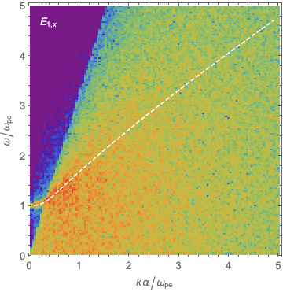
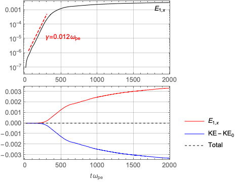
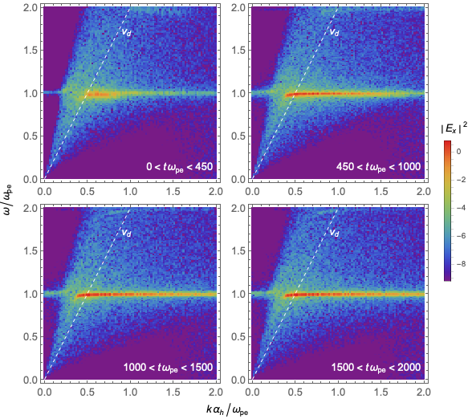
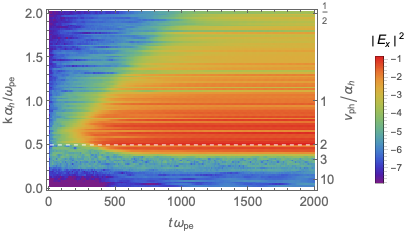
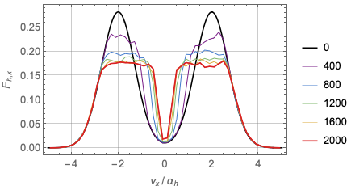

# Overview

This tutorial illustrates longitudinal waves in hot isotropic plasmas.
The first demo describes the dispersion relation,
and the second demo illustrates the two-stream instability.

# Build and Run

This tutorial includes two demo simulations located in `01_longitudinal_wave_dispersion`
and `03_two_stream_instability`.

As usual, visit each directory, build the project using `make all`, and execute `./pic_1d`.

The two-stream instability demo takes a while to complete.

# Demo Parameters

The demos assume the same parameters as the homework problems.
That is, ions are immobile and electrons are cold (magnetoionic plasma).
The uniform magnetostatic field is in the *z* direction, and the wave vector is assumed to lie in
the *x*-*z* plane.
The ratio of the electron plasma frequency to the electron cyclotron frequency is *ωpe*/*Ωce* = 2.

Time is normalized to 1/*Ωce* and the distance to the electron skin depth, *de*.

# Dispersion Relations

